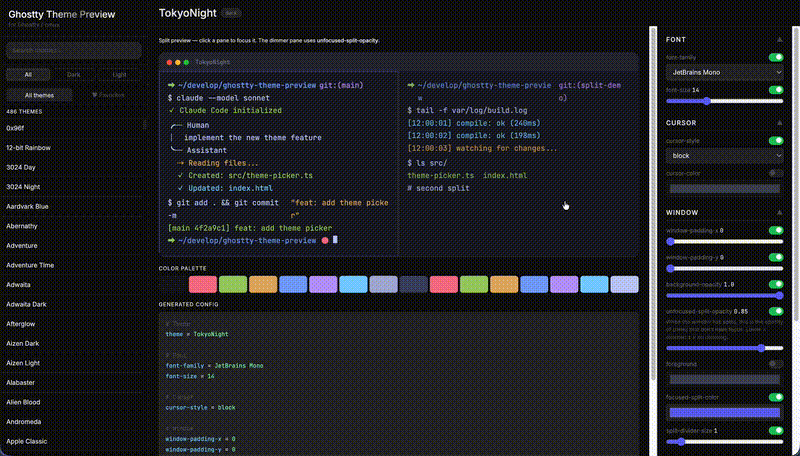

# ghostty-theme-preview

Ghostty terminal theme & config preview in your browser.



## Features

- All built-in Ghostty themes (400+)
- Font family & size preview
- Cursor style & color preview
- Background opacity, color, and image preview
- Split pane preview with unfocused-split-opacity
- Window padding, split divider size, focused-split-color
- Favorite themes (saved in localStorage)
- Auto-updated weekly via GitHub Actions
- One-click config copy

## Usage

Visit: https://eiji1202.github.io/ghostty-theme-preview

## Local preview

```bash
make start
```

Then open **http://localhost:8080/index.html**. Change the port with `make start PORT=3000`.

> `index.html` loads `themes.json` with `fetch`. Opening via `file://` is blocked by browser CORS.

## Update themes.json locally

```bash
python3 generate.py
```

## Feature requests

Feature requests and bug reports are welcome via [Issues](https://github.com/eiji1202/ghostty-theme-preview/issues).

## License

MIT
